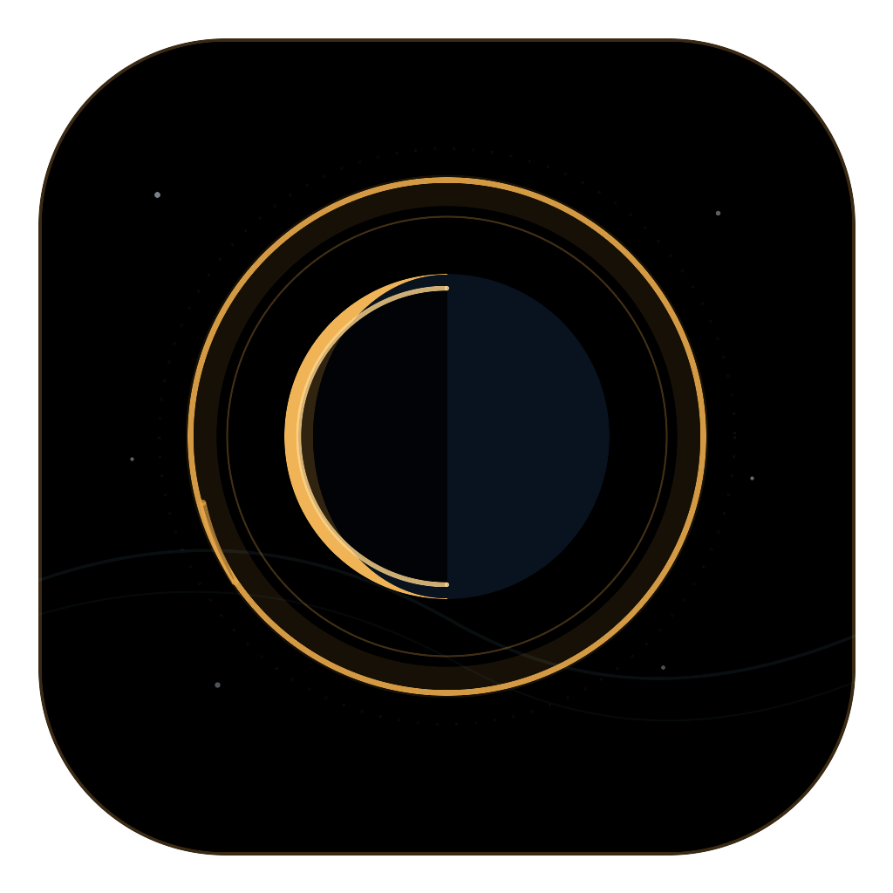

# UMBRA – Sonnenfinsternisse lokal berechnet

UMBRA ist eine vollständig lokal laufende Browser-Anwendung für globale und ortsbezogene Sonnenfinsternisse. Sie berechnet Ereignisse auf dem Mac, visualisiert die Bahn des Mondschattens auf einem interaktiven 3D-Globus und benötigt während der Nutzung weder Internetzugang noch externe Datendienste.



## Funktionen

- vergangene und kommende globale Sonnenfinsternisse
- lokale Berechnung für frei eingebbare Beobachtungsorte
- nächste am Beobachtungsort tatsächlich über dem Horizont sichtbare Finsternis, einschließlich partieller Ereignisse
- fehlertolerante Offline-Ortssuche mit mehr als 135.000 Orten und internationalen Namensvarianten
- animierter 3D-Globus mit berechneter Schattenbahn
- dezenter Marker für den gewählten Beobachtungsort auf dem Globus
- Simulation von drei Stunden vor bis drei Stunden nach dem Maximum
- synchronisierte lokale Sonnenscheibe mit bewegter Mondbedeckung
- Sonnenaufgang, Sonnenuntergang und Polartag/-nacht in der Zeitzone des Beobachtungsorts
- zehn Sprachen: Deutsch, Englisch, Spanisch, Französisch, Portugiesisch, Chinesisch, Arabisch, Hindi, Japanisch und Kroatisch
- Rechts-nach-links-Darstellung für Arabisch
- kontextbezogene Tooltips nach fünf Sekunden Hover
- eigenständiger macOS-Launcher ohne sichtbares Terminalfenster
- vollständig lokal gebündelte Weltkarte und astronomische Rechenmodelle

## Schnellstart

Voraussetzungen: macOS 12 oder neuer, Node.js 20 oder neuer und npm.

```bash
npm install
npm run dev
```

Anschließend `http://127.0.0.1:5173` öffnen.

## macOS-Launcher erstellen

```bash
npm install
npm run launcher
```

Dadurch entsteht `Start_Sonnenfinsternis.app` im Projektordner. Die App enthält den gebauten Web-Client und kann anschließend beispielsweise auf den Schreibtisch verschoben werden. Beim Start läuft der lokale Server unsichtbar im Hintergrund; Chrome wird im Vollbildmodus geöffnet, Firefox und Safari werden als Alternativen unterstützt.

## Dokumentation

- [Bedienung](docs/BEDIENUNG.md)
- [Architektur](docs/ARCHITEKTUR.md)
- [Astronomische Berechnung](docs/BERECHNUNG.md)
- [Entwicklung und Veröffentlichung](docs/ENTWICKLUNG.md)

## Technische Basis

- React und TypeScript
- Vite
- Three.js
- Astronomy Engine
- Natural-Earth-Geodaten über `world-atlas`
- Ortsdaten von [GeoNames](https://www.geonames.org/) über `all-the-cities`
- D3-Geo für eine datumsgrenzensichere Kartenprojektion

## Genauigkeit und Sicherheit

Die Anwendung ist für Planung, Information und Visualisierung vorgesehen. Sichtbedingungen hängen zusätzlich von Wetter, Horizont, Gelände und atmosphärischen Effekten ab. Niemals ohne geeigneten zertifizierten Augenschutz direkt in die Sonne schauen.

Die Zeitangaben verwenden die auf dem Mac eingestellte Zeitzone.
